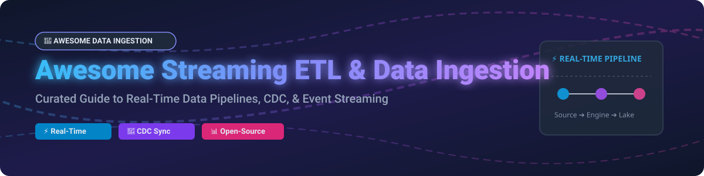

  

# 🚀 Awesome Streaming ETL & Data Ingestion

  
  
  
  

## ⚡ Top Streaming ETL & Data Ingestion Ecosystem

**Curated List of Commercial SaaS Products & Open-Source GitHub Projects**  
*Focused on Real-Time Data Pipelines, Change Data Capture (CDC), Stream Processing & Self-Hosted Data Integration*  

📅 **Last updated: October 2026**

---

## 📌 Table of Contents
- [🏢 SaaS & Hosted Platforms](#-saas--hosted-platforms)
- [🔓 Open-Source GitHub Projects](#-open-source-github-projects)
  - [🌊 Event Streaming Platforms](#-event-streaming-platforms)
  - [⚙️ Stream Processing Engines](#%EF%B8%8F-stream-processing-engines)
  - [🔄 Change Data Capture (CDC)](#-change-data-capture-cdc)
  - [🔀 ELT & Data Integration](#-elt--data-integration)
  - [🛠️ Additional Open-Source Data Tools](#%EF%B8%8F-additional-open-source-data-tools)
- [📊 Star History](#-star-history)
- [🤝 How to Contribute](#-how-to-contribute)
- [❤️ Support & Sponsorship](#%EF%B8%8F-support--sponsorship)
- [⚠️ Disclaimer](#%EF%B8%8F-disclaimer)

---

## 🏢 SaaS & Hosted Platforms

> 💡 **Market Size & Industry Dynamics**: The global Streaming ETL and Real-Time Data Integration market is estimated at **$3.5B+ (2026)** and growing at over **22% CAGR**. The sector is **moderately fragmented**: cloud providers (AWS, Azure, Google Cloud) and specialized data lakehouse platforms (Databricks) control large infrastructure footprints, while category specialists (Confluent, Fivetran, Airbyte, Striim, Redpanda, Hevo) capture high-value enterprise CDC and pipeline workloads.

| Product | Description | Best For | Company Size / Valuation / Revenue | Specific Pricing | Free Tier / Trial Limit |
| :--- | :--- | :--- | :--- | :--- | :--- |
| **[Google Cloud Dataflow](https://cloud.google.com/dataflow)** | Google's fully managed stream and batch processing based on Apache Beam. | Unified batch/stream pipelines | **~$2.0 Trillion** Market Cap (Alphabet) | $0.069 per vCPU-hr & $0.0092 per GB-hr (us-central1 streaming workers) | $300 free credits via 90-day GCP Free Trial |
| **[Amazon Kinesis Firehose](https://aws.amazon.com/kinesis/data-firehose/)** | AWS's fully managed streaming delivery service — load data into S3, Redshift, OpenSearch, and Splunk without infrastructure management. | AWS-native streaming ingestion | **~$1.9 Trillion** Market Cap (Amazon) | $0.029 per GB ingested (first 500 TB/mo, Direct PUT/KDS in 5KB increments) | Pay-as-you-go; no permanent free tier. $200 credit via 30-day AWS Free Tier |
| **[Azure Event Hubs Capture](https://azure.microsoft.com/en-us/products/event-hubs/)** | Azure's event streaming with automatic capture to Blob Storage and Azure Data Lake. | Azure-native streaming | **~$3.0 Trillion** Market Cap (Microsoft) | $0.028 per 1M ingress events + $0.015/hr per Throughput Unit (Basic tier) | $200 free credit via 30-day Azure Free Account |
| **[Databricks Auto Loader](https://www.databricks.com/)** | Incremental data ingestion for lakehouses — automatically detects and processes new files. | Databricks lakehouse ingestion | **$43.0 Billion** Valuation ($1.6B+ ARR) | $0.15 per DBU (Data Engineering workload compute) | 14-day free trial with $400 credits; or non-commercial Free Edition |
| **[Confluent Cloud](https://www.confluent.io/confluent-cloud/)** | The leading managed Kafka platform — ksqlDB, Flink, connectors, and schema registry. | Enterprise event streaming | **$7.5 Billion** Market Cap (~$900M ARR) | $0 base cost for Basic clusters (scales to zero; pay per eCKU capacity + data transfer) | 30-day free trial with $400 free credits |
| **[Fivetran](https://www.fivetran.com/)** | The leading managed ELT platform — 500+ connectors with automatic schema evolution. | Enterprise ELT | **$5.6 Billion** Valuation ($300M+ ARR) | $5 minimum base fee per connection/month + usage-based MAR rate | Free plan: up to 500,000 Monthly Active Rows (MAR) per month; plus 14-day free trial |
| **[Airbyte Cloud](https://airbyte.com/)** | Managed version of the leading open-source ELT platform — 300+ connectors. | Open-source ELT with managed convenience | **$1.5 Billion** Valuation ($50M+ ARR) | $10/month starting base plan ($2.50 per credit overage) | 30-day free trial |
| **[Striim](https://www.striim.com/)** | Real-time data integration and streaming analytics — CDC, database replication, and cloud migration. | Enterprise real-time pipelines | **~$500 Million** Valuation ($50M+ ARR) | ~$0.50 - $0.60 per vCPU hour + $0.10/GB data transfer | Striim Developer tier: free up to 25 million events per month |
| **[Redpanda Cloud](https://redpanda.com/)** | Kafka-compatible streaming platform with no Zookeeper or JVM. | High-performance streaming | **~$400 Million** Valuation ($25M+ ARR) | $0.10/cluster-hr + $0.045/GB written + $0.04/GB read (Serverless) | 30-day free trial with $100 free credits (Serverless) |
| **[Hevo Data](https://hevodata.com/)** | No-code data pipeline platform — 150+ connectors with automatic schema mapping. | No-code ETL | **~$200 Million** Valuation ($20M+ ARR) | $299/month (Starter tier, up to 5M events/month) | Free plan: up to 1 million events per month (1-hour sync, free connectors) |

---

## 🔓 Open-Source GitHub Projects

### 🌊 Event Streaming Platforms

- **[Apache Kafka](https://github.com/apache/kafka)**   
  **The de facto standard for event streaming**, Apache-2.0 licensed with 28,000+ GitHub stars. Distributed, fault-tolerant, high-throughput pub/sub messaging. **Kafka Connect for source/sink connectors** and **Kafka Streams for stream processing**. The foundation for enterprise streaming architectures.

- **[NATS](https://github.com/nats-io/nats-server)**   
  **Cloud-native messaging system**, Apache-2.0 licensed with 16,000+ GitHub stars. Lightweight, ultra-high-performance pub/sub with JetStream for persistence. Best for microservices, IoT, and edge streaming.

- **[Apache Pulsar](https://github.com/apache/pulsar)**   
  **Distributed messaging and streaming platform**, Apache-2.0 licensed with 14,000+ GitHub stars. Multi-tenancy, geo-replication, and tiered storage architecture.

- **[Redpanda](https://github.com/redpanda-data/redpanda)**   
  **Kafka-compatible streaming platform in C++**, BSL licensed. No Zookeeper, no JVM — simpler operations and ultra-low latency streaming.

---

### ⚙️ Stream Processing Engines

- **[Apache Spark](https://github.com/apache/spark)**   
  **Unified engine for large-scale data processing**, Apache-2.0 licensed with 40,000+ GitHub stars. Features **Structured Streaming** for micro-batch and continuous processing with exactly-once guarantees.

- **[Apache Flink](https://github.com/apache/flink)**   
  **The de facto standard for stateful stream processing**, Apache-2.0 licensed with 24,000+ GitHub stars. Low-latency, event-time stream processing with savepoints and state management.

- **[Apache Beam](https://github.com/apache/beam)**   
  **Unified programming model for batch and streaming pipelines**, Apache-2.0 licensed with 7,000+ GitHub stars. Runs portably across Flink, Spark, Dataflow, and Samza execution engines.

- **[ksqlDB](https://github.com/confluentinc/ksql)**   
  **Streaming SQL engine for Apache Kafka**, Confluent Community License with 5,600+ GitHub stars. Enables building stream processing applications using familiar SQL syntax.

- **[Bytewax](https://github.com/bytewax/bytewax)**   
  **Python stream processing framework** powered by a Rust execution engine, Apache-2.0 licensed with 2,500+ GitHub stars. Ideal for AI/ML real-time feature engineering.

- **[RisingWave](https://github.com/risingwavelabs/risingwave)**   
  **Distributed SQL streaming database**, Apache-2.0 licensed with 7,500+ GitHub stars. Simplifies stream processing by serving incremental materialized views using SQL.

---

### 🔄 Change Data Capture (CDC)

- **[Debezium](https://github.com/debezium/debezium)**   
  **The leading open-source CDC platform**, Apache-2.0 licensed with 11,000+ GitHub stars. Captures row-level database changes from PostgreSQL, MySQL, MongoDB, Oracle, and SQL Server into Kafka or Pulsar.

- **[Canal](https://github.com/alibaba/canal)**   
  **Alibaba's MySQL binlog incremental subscription platform**, Apache-2.0 licensed with 23,000+ GitHub stars. Widely used for database replication and real-time syncing.

- **[Maxwell](https://github.com/zendesk/maxwell)**   
  **Lightweight MySQL CDC daemon**, Apache-2.0 licensed with 3,700+ GitHub stars. Reads MySQL binlogs and writes JSON events to Kafka, Kinesis, RabbitMQ, or NATS.

- **[PeerDB](https://github.com/PeerDB-io/peerdb)**   
  **Fast Postgres-first CDC & data movement platform**, ELv2 licensed with 2,100+ GitHub stars. Optimized for high-throughput Postgres CDC to data warehouses.

---

### 🔀 ELT & Data Integration

- **[Vector](https://github.com/vectordotdev/vector)**   
  **High-performance observability data pipeline**, MPL-2.0 licensed with 19,000+ GitHub stars. Written in Rust for ultra-fast log, metric, and event ingestion.

- **[Airbyte](https://github.com/airbytehq/airbyte)**   
  **The leading open-source ELT platform**, MIT licensed with 16,000+ GitHub stars. Offers 300+ pre-built connectors for databases, SaaS applications, and warehouses.

- **[Benthos / Redpanda Connect](https://github.com/redpanda-data/connect)**   
  **High-performance code-free stream processor**, Apache-2.0 licensed with 8,500+ GitHub stars. Declarative YAML pipelines for streaming transformation and routing.

- **[Apache SeaTunnel](https://github.com/apache/seatunnel)**   
  **Next-generation high-performance data integration platform**, Apache-2.0 licensed with 7,000+ GitHub stars. Supports real-time streaming & batch synchronization.

- **[Apache NiFi](https://github.com/apache/nifi)**   
  **Visual data flow automation and routing platform**, Apache-2.0 licensed with 4,500+ GitHub stars. Enterprise drag-and-drop ingestion management.

- **[Meltano](https://github.com/meltano/meltano)**   
  **CLI-first open-source ELT platform built on Singer**, MIT licensed with 4,000+ GitHub stars. Declarative data integration for software engineering teams.

---

### 🛠️ Additional Open-Source Data Tools

- **[Apache Airflow](https://github.com/apache/airflow)**  — Workflow orchestration platform (38,000+ stars).
- **[dbt Core](https://github.com/dbt-labs/dbt-core)**  — SQL-based data transformation in data warehouses (10,500+ stars).
- **[Fluent Bit](https://github.com/fluent/fluent-bit)**  — Fast lightweight log & metrics processor for K8s (5,500+ stars).
- **[dlt (data load tool)](https://github.com/dlt-hub/dlt)**  — Python library for automated data loading into warehouses (3,800+ stars).

---

## 📊 Star History

---

## 🤝 How to Contribute

Contributions are welcome! Please follow these simple guidelines:
1. Fork this repository.
2. Add or update entries following the table/badge formatting standard.
3. Ensure links are working and pointed to official project repositories/websites.
4. Submit a Pull Request (PR) with a brief summary of your changes.

Check out [Awesome-Awesome-Awesome](https://github.com/ishandutta2007/Awesome-Awesome-Awesome) for more curated lists!

---

## ❤️ Support & Sponsorship

Thank you for exploring and using **Awesome-Streaming-ETL-Data-Ingestion**! If you find this list helpful for your architecture decisions or research, please consider:
- 🌟 **Starring** this repository on GitHub.
- 🔄 **Forking & Sharing** with your data engineering team and community.
- ☕ **Sponsoring / Buying a coffee**: Support ongoing maintenance via the [GitHub Sponsor Dashboard](https://github.com/sponsors/ishandutta2007).

---

## ⚠️ Disclaimer

- This list is **community-curated** for educational and architectural reference — it does not imply commercial endorsement.
- Streaming ETL platforms process mission-critical data in motion. Always evaluate security controls, data privacy compliance, and licensing (e.g., Apache-2.0, BSL, ELv2) prior to production deployment.
